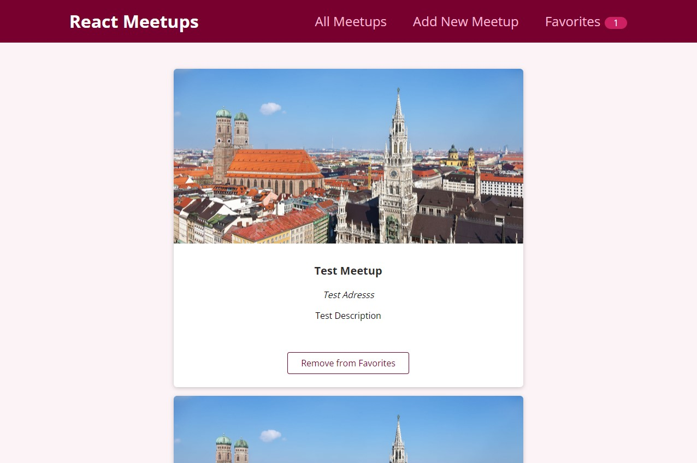
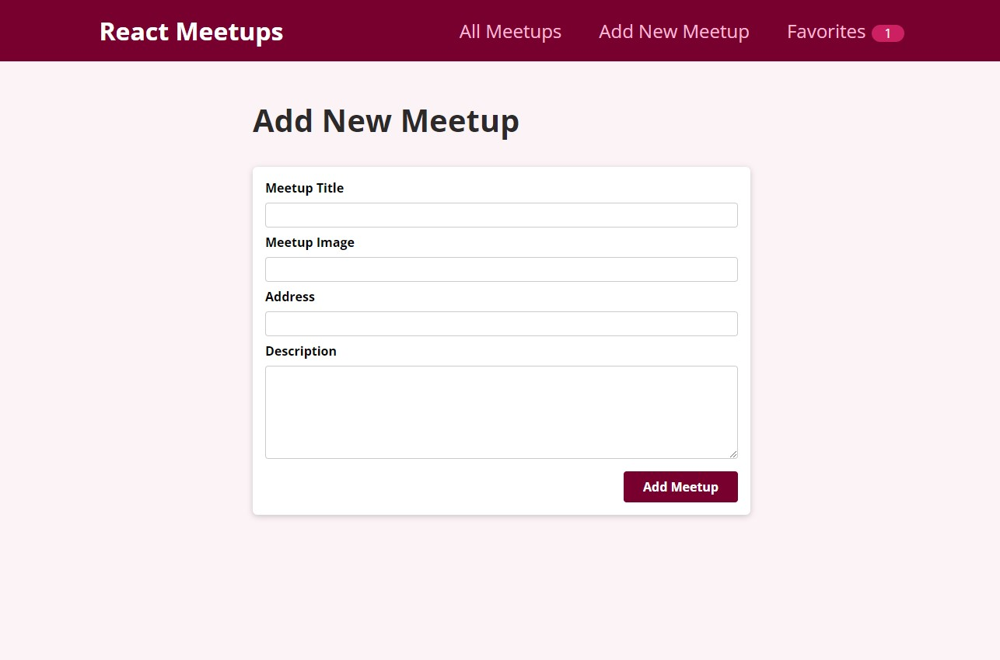
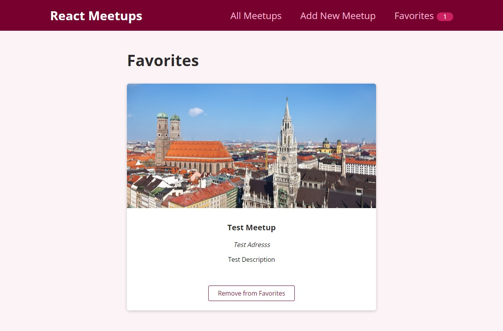

# React - Meetup Project

[This project](https://gurhanalan.github.io/React-Meetup-Project/) is a single page meetup website. This site is build with using React.

## Table of contents

-   [React - Meetup Project](#react---meetup-project)
    -   [Table of contents](#table-of-contents)
    -   [Overview](#overview)
        -   [The challenge](#the-challenge)
        -   [Screenshots](#screenshots)
        -   [Links](#links)
    -   [My process](#my-process)
        -   [Built with](#built-with)

## Overview

### The challenge

Users should be able to:

<!-- -   View the optimal layout for the app depending on their device's screen size -->

-   See hover states for all interactive elements on the page
-   Get meetups from server
-   Add meetups to favorites
-   Remove meetups to favorites
-   Add meetups to general meetup list
<!-- -   Change the position, color, shape and size of a box by click the control buttons. -->

### Screenshots

<!--   -->

 
 
 

<!--  -->

### Links

-   Solution URL: [Live Website](https://gurhanalan.github.io/React-Meetup-Project/)

## My process

### Built with

-   React
-   Functional Components
-   Modular CSS
-   React Hooks (useState, useRef, useContext)
-   Context
